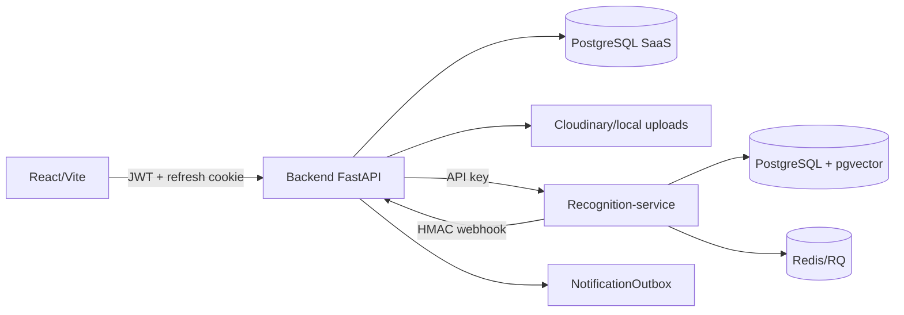

# Status Atual do Sistema Escolar

**Data da análise:** 08 de setembro de 2026  
**Escopo:** `backend_v2`, `frontend_v2` e `recognition-service`  
**Autoridade:** este documento descreve o estado observado no código atual. Documentos anteriores podem conter decisões históricas.

## Resumo executivo

O workspace contém três aplicações relacionadas:

- `frontend_v2`: SPA React/Vite para login, alunos, presenças, notificações, reconhecimento e administração.
- `backend_v2`: API FastAPI responsável por autenticação, multi-tenant por escola, alunos, responsáveis, presenças, notificações e integração biométrica.
- `recognition-service`: API/worker FastAPI com InsightFace, PostgreSQL/pgvector, Redis/RQ e webhook de presença.

A arquitetura está funcional para MVP e possui testes de backend e do serviço facial. Ela ainda não deve ser considerada pronta para escala multi-tenant crítica sem tratar a entrega confiável de webhooks, o isolamento por escola, a consistência das operações biométricas e os defaults de implantação.

## Arquitetura real

### Responsabilidades

| Serviço | Responsabilidades | Estado observado |
|---|---|---|
| Frontend | SPA, autenticação, CRUD de alunos, presenças e reconhecimento | Build configurado; sem testes automatizados |
| Backend | API pública, autorização, persistência SaaS, notificações e integração facial | Paginação e rate limit de login implementados |
| Recognition-service | Embeddings, busca vetorial, deduplicação, auditoria e presença local | Operação assíncrona com worker; webhook sem retry persistente |

O backend usa `routes -> services -> repositories -> models`. O serviço facial separa rotas, worker, inferência, auditoria e integração com o SaaS.

## Fluxos principais

### Autenticação

1. O frontend faz login em `/api/auth/login`.
2. O backend retorna access token e configura refresh token em cookie.
3. O frontend ainda persiste o access token em `localStorage`.
4. O cliente renova o token por `/api/auth/refresh`.
5. Refresh tokens são persistidos, rotacionados e revogáveis.

O rate limit atual protege somente `POST /api/auth/login`, com cinco tentativas por IP em 60 segundos, armazenadas na memória do processo.

### Cadastro biométrico

1. O backend salva a foto.
2. Cria ou atualiza o aluno.
3. Chama o recognition-service de forma síncrona.
4. Atualiza `biometria_status`, erro e contador de amostras.

A indisponibilidade do serviço facial não impede necessariamente a resposta de cadastro; o aluno pode ficar em estado `failed` ou `retrying`. Não há uma fila persistente geral para repetir automaticamente essa sincronização.

### Reconhecimento e presença

O endpoint de identificação do backend pode reconhecer um aluno sem criar presença. O fluxo de câmera do recognition-service:

1. decodifica e valida a imagem;
2. extrai embedding;
3. consulta os candidatos no pgvector;
4. aplica threshold e margem de ambiguidade;
5. aplica deduplicação Redis;
6. grava a presença no banco facial;
7. envia webhook assinado ao backend;
8. registra auditoria.

O backend usa `recognition_event_id` para idempotência e também evita entradas/saídas equivalentes no mesmo dia.

## Contratos importantes

### Imagens

O frontend e o backend aceitam JPEG, PNG e WEBP. O recognition-service aceita somente JPEG/JPG/PNG e valida assinatura binária JPEG/PNG. Até a padronização, WEBP deve ser rejeitado na origem ou convertido antes da integração.

### Webhook

O webhook usa HMAC SHA-256, `Idempotency-Key` e `event_id`. A operação é idempotente no backend, mas o recognition-service não mantém uma outbox persistente para reenviar eventos que falharam.

### Tenant/escola

O worker do recognition-service filtra consultas por `SCHOOL_ID`, configurado por instância. Isso limita o modelo SaaS: uma instância não deve receber dados de várias escolas sem uma camada segura de resolução e autorização de tenant.

## Modelo de dados

O backend possui entidades para usuários, alunos, responsáveis, presenças, fotos biométricas, notificações, embeddings locais e refresh tokens. Existem constraints para:

- número de inscrição por empresa;
- `external_id` por empresa;
- `recognition_event_id`;
- idempotência de notificações por presença, responsável e canal.

`Aluno` mantém `user_id` e `empresa_id`, ambos relacionados ao proprietário. A semântica duplicada precisa ser formalizada para evitar divergência futura.

## Testes e validação

Inventário estático observado em 08/09/2026:

- Backend: 10 arquivos de teste e 68 funções/classes de teste.
- Recognition-service: 5 arquivos de teste e 16 funções/classes de teste.
- Frontend: nenhum script ou teste automatizado no `package.json`.
- Migrações backend: 10 arquivos Alembic.

Os testes do backend usam SQLite e `Base.metadata.create_all()`. Eles não validam completamente PostgreSQL, pgvector, a cadeia Alembic, Redis real, RQ ou concorrência entre réplicas.

Nesta análise, a compilação sintática Python passou. A execução de `pytest` e o build do frontend não foram executados porque o ambiente não tinha `pytest` nem `npm` instalados.

## Riscos prioritários

### P0

1. Webhook sem retry persistente pode perder presenças no SaaS.
2. `SCHOOL_ID` fixo impede expansão multi-tenant segura.
3. Defaults previsíveis no `docker-compose.yml` não podem chegar à produção.
4. Operações biométricas locais e remotas podem divergir após falhas parciais.

### P1

1. Access token em `localStorage` aumenta impacto de XSS.
2. Rate limit em memória funciona mal com múltiplas réplicas e protege poucas rotas.
3. Contrato WEBP é incompatível.
4. Imagens com múltiplos rostos selecionam uma face em vez de rejeitar o arquivo.
5. Cadastro biométrico síncrono não possui retry persistente.
6. Deduplicação Redis e deduplicação diária precisam de regra única.
7. Outbox de notificações precisa de garantia explícita contra concorrência.
8. Migrações e infraestrutura real não são cobertas pela suíte atual.

### P2

1. Consolidar URLs de integração facial.
2. Formalizar `user_id` versus `empresa_id`.
3. Adicionar testes de frontend e E2E em CI.
4. Adicionar métricas, tracing, alertas e reconciliação entre bancos.
5. Documentar retenção e governança de dados biométricos conforme LGPD.

## Ordem recomendada de trabalho

1. Implementar outbox e retry persistente do webhook.
2. Definir o modelo de isolamento por escola.
3. Remover defaults inseguros e validar configuração no startup.
4. Tornar operações biométricas idempotentes e reconciliáveis.
5. Corrigir o contrato de imagem e rejeitar múltiplos rostos.
6. Migrar rate limiting para Redis.
7. Criar ambiente de integração com PostgreSQL, pgvector e Redis reais.
8. Atualizar os testes e executar o E2E completo em staging.
9. Migrar o access token para cookie protegido, com estratégia CSRF adequada.

## Fontes no código

- Backend: `backend_v2/main.py`, `app/routes`, `app/services`, `app/repositories` e `app/tests`.
- Frontend: `frontend_v2/src/App.jsx`, `src/services`, `src/pages` e `package.json`.
- Recognition-service: `recognition-service/app/main.py`, `app/queue`, `app/services`, `app/core` e `tests`.
- E2E: `backend_v2/docs/E2E_RECOGNITION_FLOW.md`.
